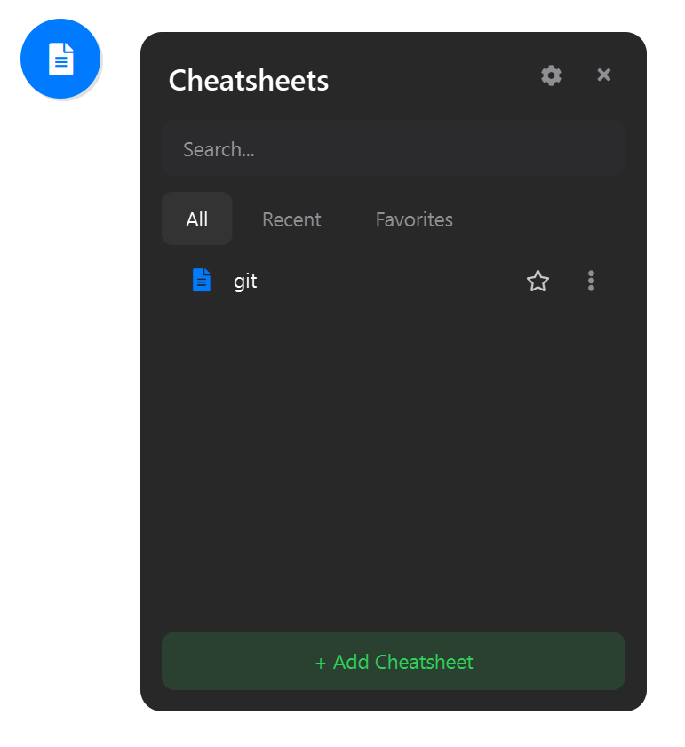
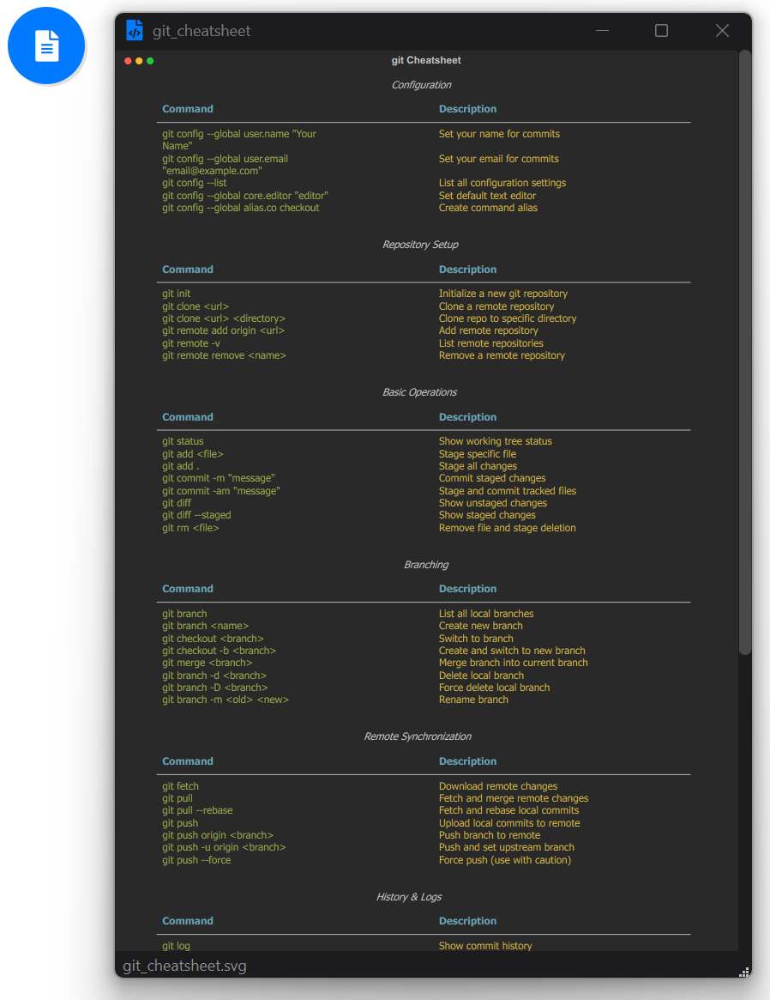

# Auto Cheatsheet

A lightweight desktop application for viewing and managing command-line cheatsheets with a floating orb interface.

<p align = "center">
  
  
</p>

## Features

- **Floating Orb Interface** - Quick access from anywhere on your screen
- **SVG Rendering** - High-quality cheatsheet display
- **Auto-Generation** - Automatically generates cheatsheets from YAML files
- **Logging** - All runtime output saved to `/log/` directory
- **Portable** - Single executable, no installation required

## Quick Start

### Running from Source

```bash
# Install dependencies
pip install -r requirements.txt

# Run application
python app.py
```

### Building Executable

```bash
# Build with Nuitka (10-12 minutes)
python script/build_nuitka.py

# Create distribution package
python script/package_release.py
```

Output: `dist/AutoCheatsheet_YYYYMMDD_HHMMSS.zip` (31 MB)

## Project Structure

```
auto_cheatsheet/
├── app.py              # Main application entry
├── main.py             # Cheatsheet generator
├── core/               # Core functionality
│   ├── logger.py       # Logging system
│   └── settings_manager.py
├── ui/                 # UI components
│   ├── floating_orb.py # Floating orb interface
│   └── svg_viewer.py   # SVG viewer window
├── script/             # Build scripts
│   ├── build_nuitka.py # Nuitka build script
│   └── package_release.py
└── src/
    ├── doc/            # YAML cheatsheet definitions
    └── svg/            # Generated SVG files
```

## Creating Cheatsheets

Add YAML files to `src/doc/`:

```yaml
filename: example_cheatsheet
terminal_title: Example Commands
sections:
  - title: Basic Commands
    commands:
      - command: example --help
        description: Show help information
```

Run the app to auto-generate SVG cheatsheets.

## Build Configuration

- **Compiler**: Nuitka with MinGW64
- **Build Time**: ~10-12 minutes (LTO disabled)
- **Output Size**: 31.2 MB
- **Log Retention**: Last 10 runs

## Requirements

- Python 3.11+
- PySide6
- PyYAML
- resvg-py
- qtawesome

## License

MIT