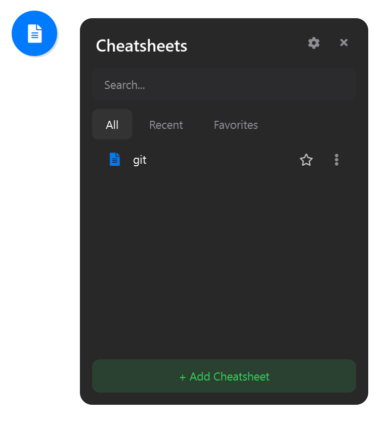
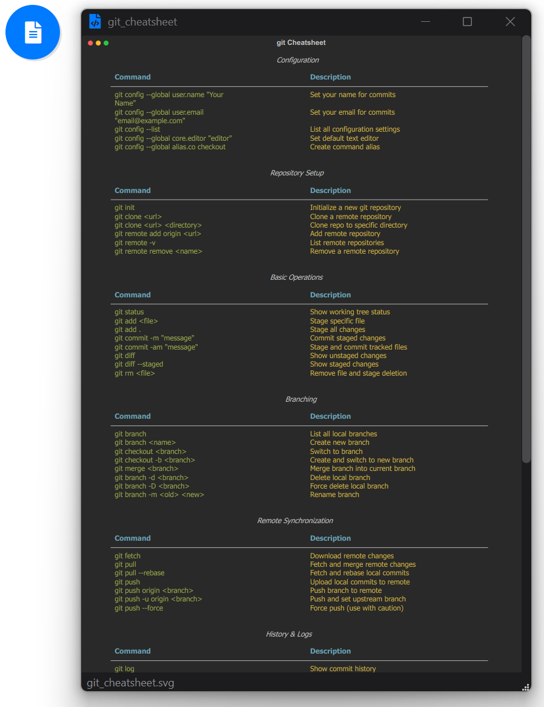
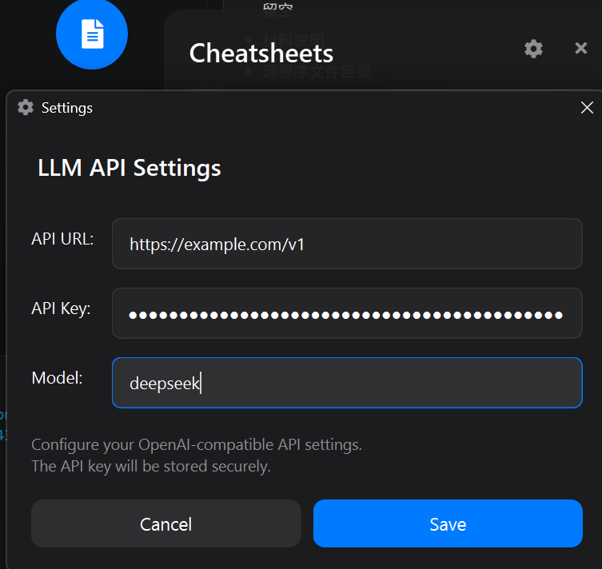
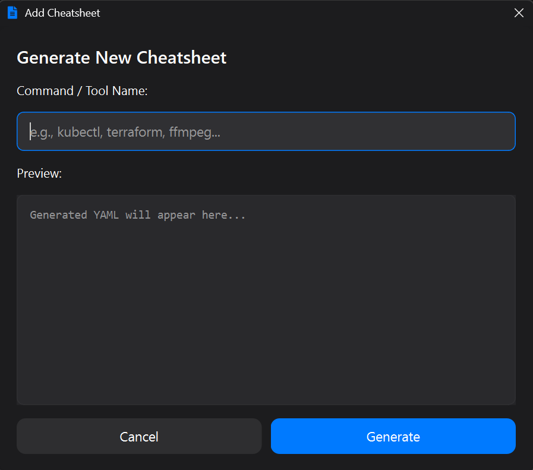
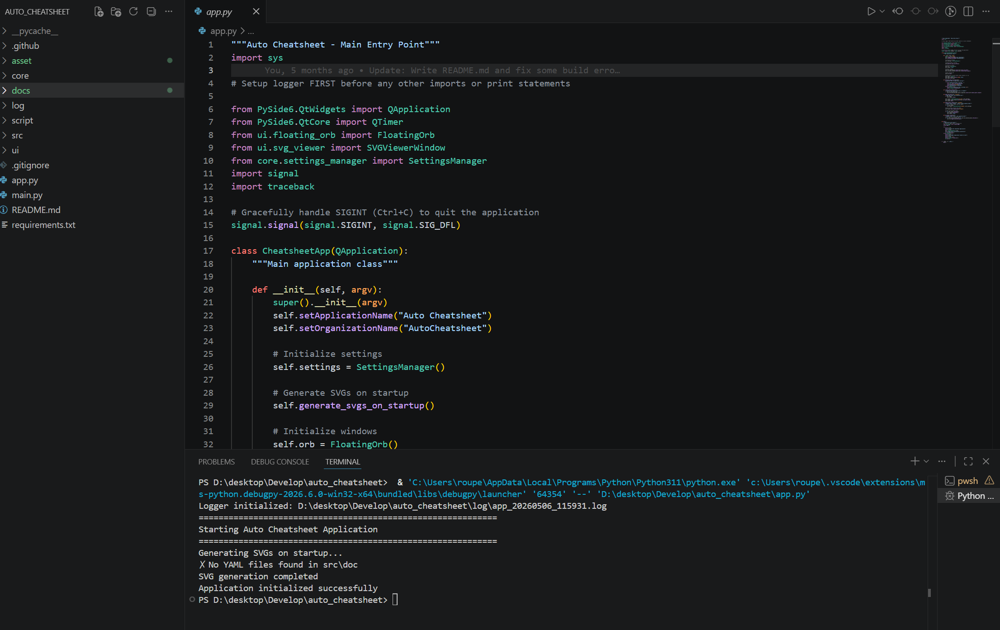
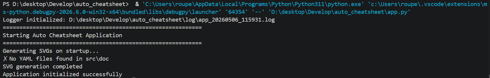

# 文档鉴别材料

## 一、基本信息

| 项目 | 内容 |
| --- | --- |
| 软件名称 | Auto Cheatsheet |
| 软件版本号 |  |
| 权利人 |  |
| 文档名称 | Auto Cheatsheet 软件说明文档 |
| 文档版本 |  |
| 开发完成日期 |  |
| 首次发表日期 |  |
| 材料生成日期 | 2026-05-06 |

## 二、材料说明

1. 本材料用于软件著作权登记申请中的文档鉴别材料。
2. 本材料按文档前后连续材料的要求整理，包含软件整体说明、功能描述、设计说明、运行环境、使用流程、测试结果和界面图示。
3. 本材料引用项目 `asset/images/` 目录下已有截图，用于说明软件主要界面和操作流程。
4. 权利人署名、软件名称、软件版本号等信息应与其他申请文件保持一致；涉及申请主体和隐私的信息已留空，由申请人自行填写。

## 三、软件概述

Auto Cheatsheet 是一款用于生成、查看和管理命令行速查表的桌面应用程序。软件以 YAML 文件作为速查表内容来源，通过自动化生成流程输出 SVG 格式的速查表，并提供桌面悬浮球入口、速查表菜单、SVG 查看器、PNG 导出、收藏、最近使用记录、AI 辅助生成和配置管理等功能。

软件面向需要频繁查询命令行用法的开发人员、运维人员和技术学习者，目标是减少在文档和终端之间频繁切换的成本，使常用命令能够通过桌面悬浮入口快速打开、查看和导出。

## 四、软件功能列表

| 序号 | 功能模块 | 功能说明 | 主要文件 |
| ---: | --- | --- | --- |
| 1 | 应用启动 | 初始化日志系统、配置管理、悬浮球和 SVG 查看窗口，并在启动时自动扫描生成速查表。 | `app.py` |
| 2 | 速查表生成 | 扫描 `src/doc/` 下的 YAML 文件，校验内容结构，生成 SVG 文件，可选生成 PNG 文件。 | `main.py` |
| 3 | SVG 渲染处理 | 使用 Rich 表格渲染命令内容，生成终端风格 SVG，并对标题、分割线和排版进行后处理。 | `script/svg_processor.py` |
| 4 | PNG 导出 | 将 SVG 文件转换为 PNG 图片，支持浏览器渲染和字体资源处理。 | `script/svg_to_png.py` |
| 5 | 悬浮球入口 | 提供始终置顶的桌面悬浮球，支持拖动、贴边、点击打开菜单和右键退出。 | `ui/floating_orb.py` |
| 6 | 速查表菜单 | 展示全部、最近和收藏速查表，支持搜索、打开、收藏、导出、编辑和删除。 | `ui/selection_menu.py` |
| 7 | SVG 查看器 | 打开 SVG 速查表，支持窗口适配、主题切换、缩放和导出 PNG。 | `ui/svg_viewer.py` |
| 8 | AI 生成 | 根据命令或工具名称调用 OpenAI 兼容接口生成速查表 YAML 内容。 | `script/llm_generator.py` |
| 9 | 设置管理 | 持久化窗口位置、主题、最近文件、收藏文件、缩放比例和 AI 接口配置。 | `core/settings_manager.py` |
| 10 | 日志记录 | 将运行输出写入日志文件，并保留最近 10 次运行日志。 | `core/logger.py` |
| 11 | 构建发布 | 使用 Nuitka 构建可执行程序，并生成发布压缩包。 | `script/build_nuitka.py`、`script/package_release.py` |

## 五、运行环境

| 类别 | 要求 |
| --- | --- |
| 操作系统 | Windows 桌面环境 |
| Python 版本 | Python 3.11 或以上 |
| 图形界面框架 | PySide6、PySide6-Addons |
| 图标库 | QtAwesome |
| 数据解析 | PyYAML |
| SVG 生成 | Rich |
| PNG 转换 | resvg-py、Playwright（可选） |
| 网络请求 | requests |
| 构建工具 | Nuitka、MinGW64 |

## 六、软件目录结构

| 路径 | 类型 | 说明 |
| --- | --- | --- |
| `app.py` | 程序入口 | 桌面应用主入口，负责创建 QApplication 和主界面对象。 |
| `main.py` | 生成入口 | 扫描 YAML 文件并生成 SVG/PNG 速查表。 |
| `core/` | 核心模块 | 包含日志系统和配置管理。 |
| `ui/` | 界面模块 | 包含悬浮球、菜单、查看器、设置窗口和确认窗口。 |
| `script/` | 脚本模块 | 包含 SVG 处理、PNG 转换、AI 生成、构建和发布脚本。 |
| `asset/icon/` | 资源目录 | 存放软件图标。 |
| `asset/font/` | 资源目录 | 存放 FiraCode 字体资源。 |
| `asset/images/` | 资源目录 | 存放软件界面截图和说明图片。 |
| `docs/` | 文档目录 | 存放软件著作权申请相关材料。 |
| `requirements.txt` | 依赖清单 | 记录软件运行和开发依赖。 |

## 七、系统架构说明

软件采用“数据文件输入、生成脚本处理、桌面界面展示”的结构。用户维护或生成 YAML 文件后，生成模块读取其中的标题、分组、命令和说明信息，再使用 Rich 生成终端风格的 SVG 文件。桌面端 UI 负责发现生成结果、展示列表、打开查看窗口和执行导出操作。

| 层级 | 组成 | 职责 |
| --- | --- | --- |
| 表现层 | 悬浮球、选择菜单、SVG 查看器、设置窗口 | 提供桌面交互入口和速查表查看能力。 |
| 业务层 | 扫描生成、内容校验、收藏管理、最近记录、导出管理 | 执行速查表生成、文件管理和状态维护。 |
| 数据层 | YAML 文件、SVG 文件、PNG 文件、QSettings 配置、日志文件 | 保存用户数据、生成结果、配置状态和运行记录。 |
| 支撑层 | Rich、PySide6、QtAwesome、resvg-py、requests | 提供渲染、界面、图标、转换和接口访问能力。 |

## 八、主要业务流程

### 8.1 软件启动流程

| 步骤 | 处理内容 |
| ---: | --- |
| 1 | 用户运行 `python app.py` 或启动已构建的可执行文件。 |
| 2 | 程序初始化日志系统，将标准输出和错误输出写入日志文件。 |
| 3 | 程序创建 QApplication 实例并加载配置管理器。 |
| 4 | 程序扫描 `src/doc/` 目录中的 YAML 文件。 |
| 5 | 程序根据 YAML 内容生成或更新 SVG 速查表。 |
| 6 | 程序创建悬浮球窗口并显示在桌面上。 |
| 7 | 用户点击悬浮球后打开速查表选择菜单。 |

### 8.2 速查表生成流程

| 步骤 | 输入 | 输出 | 说明 |
| ---: | --- | --- | --- |
| 1 | """Custom delete confirmation dialog matching settings style"""import sysfrom PySide6.QtWidgets import QDialog, QVBoxLayout, QHBoxLayout, QLabel, QPushButtonfrom PySide6.QtCore import Qtfrom PySide6.QtGui import QPalette, QColorfrom core.settings_manager import SettingsManagerfrom ui.icon_manager import IconManager​# Windows dark title bar supportif sys.platform == 'win32':    try:        import ctypes        from ctypes import windll, c_int, byref        DWMWA_USE_IMMERSIVE_DARK_MODE = 20        DWMWA_CAPTION_COLOR = 35    except ImportError:        DWMWA_USE_IMMERSIVE_DARK_MODE = None        DWMWA_CAPTION_COLOR = None​​class DeleteConfirmationDialog(QDialog):    """Custom styled delete confirmation dialog"""        def __init__(self, cheatsheet_name, parent=None):        super().__init__(parent)        self.settings = SettingsManager()        self._dark_titlebar_applied = False        self.setup_ui(cheatsheet_name)        self.apply_theme()        def setup_ui(self, cheatsheet_name):        """Setup UI elements"""        self.setWindowTitle("Delete Cheatsheet")        self.setWindowIcon(IconManager.get_window_icon())        self.setWindowFlags(Qt.WindowType.Dialog \| Qt.WindowType.WindowStaysOnTopHint)        self.setModal(True)        self.setFixedWidth(400)                # Force dark palette        dark_palette = QPalette()        dark_palette.setColor(QPalette.ColorRole.Window, QColor(28, 28, 30))        dark_palette.setColor(QPalette.ColorRole.WindowText, QColor(255, 255, 255))        self.setPalette(dark_palette)                # Main layout        layout = QVBoxLayout(self)        layout.setContentsMargins(20, 20, 20, 20)        layout.setSpacing(10)                # Title        title = QLabel("Delete Cheatsheet")        title.setObjectName("dialogTitle")        layout.addWidget(title)                # Message        message = QLabel(f"Are you sure you want to delete '{cheatsheet_name}'?\nThis will delete both the YAML and SVG files.\n")        message.setObjectName("messageText")        message.setWordWrap(True)        layout.addWidget(message)                # Buttons        button_layout = QHBoxLayout()        button_layout.setSpacing(20)                cancel_btn = QPushButton("Cancel")        cancel_btn.setObjectName("secondaryButton")        cancel_btn.setFixedHeight(40)        cancel_btn.clicked.connect(self.reject)        button_layout.addWidget(cancel_btn)                delete_btn = QPushButton("Delete")        delete_btn.setObjectName("deleteButton")        delete_btn.setFixedHeight(40)        delete_btn.clicked.connect(self.accept)        button_layout.addWidget(delete_btn)                layout.addLayout(button_layout)        def showEvent(self, event):        """Override show event to apply dark titlebar before window appears"""        super().showEvent(event)        if not self._dark_titlebar_applied:            self._dark_titlebar_applied = True            self.apply_windows_dark_titlebar()        def apply_windows_dark_titlebar(self):        """Apply dark title bar on Windows"""        if sys.platform == 'win32' and DWMWA_USE_IMMERSIVE_DARK_MODE is not None:            try:                hwnd = int(self.winId())                value = c_int(1)                windll.dwmapi.DwmSetWindowAttribute(                    hwnd, DWMWA_USE_IMMERSIVE_DARK_MODE,                    byref(value), ctypes.sizeof(value)                )                color = c_int(0x1e1c1c)                windll.dwmapi.DwmSetWindowAttribute(                    hwnd, DWMWA_CAPTION_COLOR,                    byref(color), ctypes.sizeof(color)                )            except Exception:                pass        def apply_theme(self):        """Apply theme styling"""        theme = self.settings.get_theme()                if theme == "dark":            self.setStyleSheet("""                QDialog {                    background-color: rgba(28, 28, 30, 0.98);                    border-radius: 12px;                }                QLabel#dialogTitle {                    color: #ffffff;                    font-size: 20px;                    font-weight: 600;                    font-family: -apple-system, 'SF Pro Display', 'Segoe UI', sans-serif;                    padding-bottom: 10px;                }                QLabel#messageText {                    color: #ffffff;                    font-size: 14px;                    font-family: -apple-system, 'SF Pro Text', 'Segoe UI', sans-serif;                    line-height: 1.5;                }                QPushButton#deleteButton {                    padding: 11px 24px;                    border: none;                    border-radius: 10px;                    background-color: #ff3b30;                    color: white;                    font-size: 15px;                    font-weight: 500;                    font-family: -apple-system, 'SF Pro Text', 'Segoe UI', sans-serif;                    min-width: 100px;                }                QPushButton#deleteButton:hover {                    background-color: #ff453a;                }                QPushButton#deleteButton:pressed {                    background-color: #d70015;                }                QPushButton#secondaryButton {                    padding: 11px 24px;                    border: none;                    border-radius: 10px;                    background-color: rgba(58, 58, 60, 0.6);                    color: #ffffff;                    font-size: 15px;                    font-weight: 500;                    font-family: -apple-system, 'SF Pro Text', 'Segoe UI', sans-serif;                    min-width: 100px;                }                QPushButton#secondaryButton:hover {                    background-color: rgba(68, 68, 70, 0.7);                }                QPushButton#secondaryButton:pressed {                    background-color: rgba(48, 48, 50, 0.8);                }            """)        else:            self.setStyleSheet("""                QDialog {                    background-color: rgba(255, 255, 255, 0.98);                    border-radius: 12px;                }                QLabel#dialogTitle {                    color: #000000;                    font-size: 20px;                    font-weight: 600;                    font-family: -apple-system, 'SF Pro Display', 'Segoe UI', sans-serif;                    padding-bottom: 10px;                }                QLabel#messageText {                    color: #000000;                    font-size: 14px;                    font-family: -apple-system, 'SF Pro Text', 'Segoe UI', sans-serif;                    line-height: 1.5;                }                QPushButton#deleteButton {                    padding: 11px 24px;                    border: none;                    border-radius: 10px;                    background-color: #ff3b30;                    color: white;                    font-size: 15px;                    font-weight: 500;                    font-family: -apple-system, 'SF Pro Text', 'Segoe UI', sans-serif;                    min-width: 100px;                }                QPushButton#deleteButton:hover {                    background-color: #ff453a;                }                QPushButton#deleteButton:pressed {                    background-color: #d70015;                }                QPushButton#secondaryButton {                    padding: 11px 24px;                    border: none;                    border-radius: 10px;                    background-color: rgba(229, 229, 234, 0.6);                    color: #000000;                    font-size: 15px;                    font-weight: 500;                    font-family: -apple-system, 'SF Pro Text', 'Segoe UI', sans-serif;                    min-width: 100px;                }                QPushButton#secondaryButton:hover {                    background-color: rgba(209, 209, 214, 0.7);                }                QPushButton#secondaryButton:pressed {                    background-color: rgba(199, 199, 204, 0.8);                }            """)python | 原始数据对象 | 读取并解析 YAML 内容。 |
| 2 | 原始数据对象 | 校验结果 | 检查 `filename` 和 `sections` 等必填字段。 |
| 3 | 校验通过的数据 | SVG 文件 | 调用 Rich 生成终端风格表格。 |
| 4 | SVG 文件 | 后处理 SVG | 调整标题字号、分割线和章节标题位置。 |
| 5 | SVG 文件 | PNG 文件 | 当用户请求导出时转换为 PNG 图片。 |
| 6 | 文件内容哈希 | `src/data.yaml` | 保存内容哈希，用于判断下次是否需要重新生成。 |

### 8.3 用户查看流程

| 步骤 | 操作 | 软件响应 |
| ---: | --- | --- |
| 1 | 用户点击桌面悬浮球 | 打开速查表选择菜单。 |
| 2 | 用户在菜单中搜索或切换分类 | 软件过滤全部、最近或收藏列表。 |
| 3 | 用户选择某个速查表 | 软件关闭菜单并打开 SVG 查看窗口。 |
| 4 | 用户在查看窗口中浏览内容 | 软件按窗口大小自动适配显示。 |
| 5 | 用户点击导出 | 软件将当前 SVG 转换并保存为 PNG。 |
| 6 | 用户关闭查看窗口 | 软件可重新显示选择菜单。 |

### 8.4 AI 生成流程

| 步骤 | 操作 | 软件响应 |
| ---: | --- | --- |
| 1 | 用户打开新增速查表窗口 | 显示命令或工具名称输入框。 |
| 2 | 用户输入命令名称并点击生成 | 软件读取 AI 接口地址、密钥和模型配置。 |
| 3 | 软件构造提示词 | 要求接口返回符合项目格式的 YAML 内容。 |
| 4 | 接口返回文本 | 软件清理 Markdown 代码块等包裹内容。 |
| 5 | 用户确认并保存 | 软件写入 YAML 文件并触发 SVG 重新生成。 |

## 九、界面图示

### 9.1 主菜单界面

主菜单用于集中展示速查表列表，支持全部、最近、收藏等分类，并提供搜索、新增、设置、关闭等入口。



### 9.2 SVG 查看界面

SVG 查看界面用于查看生成后的命令速查表，支持窗口适配、主题切换和导出 PNG。



### 9.3 API 配置界面

API 配置界面用于设置 OpenAI 兼容接口地址、API Key 和模型名称，供 AI 生成速查表功能调用。



### 9.4 新增速查表界面

新增速查表界面用于输入命令或工具名称，并生成对应 YAML 内容。



### 9.5 开发与运行界面

开发运行界面展示软件在本地开发环境中的启动和调试状态。



### 9.6 终端效果图

终端效果图展示速查表生成后的终端风格视觉呈现。



## 十、数据格式说明

速查表内容以 YAML 文件保存。每个 YAML 文件描述一个速查表，包括输出文件名、终端标题、章节列表、命令和说明。

| 字段 | 类型 | 是否必填 | 说明 |
| --- | --- | --- | --- |
| `filename` | 字符串 | 是 | 生成 SVG/PNG 文件时使用的文件名。 |
| `terminal_title` | 字符串 | 否 | SVG 顶部显示的终端标题。 |
| `sections` | 列表 | 是 | 速查表章节列表。 |
| `sections[].title` | 字符串 | 是 | 章节标题。 |
| `sections[].commands` | 列表 | 是 | 当前章节下的命令条目。 |
| `sections[].commands[].command` | 字符串 | 是 | 命令文本。 |
| `sections[].commands[].description` | 字符串 | 是 | 命令说明。 |

示例格式如下：

```yaml
filename: example_cheatsheet
terminal_title: Example Commands
sections:
  - title: Basic Commands
    commands:
      - command: example --help
        description: Show help information
```

## 十一、配置项说明

| 配置项 | 保存键 | 默认值 | 说明 |
| --- | --- | --- | --- |
| 悬浮球横坐标 | `orb/x` | `100` | 保存悬浮球在桌面上的横向位置。 |
| 悬浮球纵坐标 | `orb/y` | `100` | 保存悬浮球在桌面上的纵向位置。 |
| 窗口几何信息 | `window/geometry` | 空 | 保存 SVG 查看窗口大小和位置。 |
| 界面主题 | `appearance/theme` | `dark` | 保存深色或浅色主题设置。 |
| 最近文件 | `recent/files` | 空列表 | 保存最近打开的速查表文件。 |
| 收藏文件 | `favorites/files` | 空列表 | 保存用户收藏的速查表文件。 |
| 查看缩放比例 | `viewer/zoom` | `1.0` | 保存 SVG 查看窗口缩放比例。 |
| YAML 编辑器路径 | `editor/yaml` | 空 | 保存外部 YAML 编辑器路径。 |
| AI 接口地址 | `llm/api_url` | `https://api.openai.com/v1` | 保存 OpenAI 兼容接口地址。 |
| AI 接口密钥 | `llm/api_key` | 空 | 保存 AI 接口密钥。 |
| AI 模型名称 | `llm/model` | `gpt-4` | 保存 AI 生成使用的模型名称。 |

## 十二、主要模块说明

| 模块 | 主要类或函数 | 说明 |
| --- | --- | --- |
| `app.py` | `CheatsheetApp`、`main` | 创建桌面应用，连接悬浮球和查看器，处理导出请求。 |
| `main.py` | `scan_and_generate`、`process_cheatsheet`、`load_data` | 管理 YAML 扫描、内容校验、SVG 生成和内容哈希保存。 |
| `core/logger.py` | `setup_logger`、`TeeOutput` | 初始化日志目录，将运行输出同步写入控制台和日志文件。 |
| `core/settings_manager.py` | `SettingsManager` | 统一封装 QSettings 读写逻辑。 |
| `script/svg_processor.py` | `generate_svg`、`post_process_svg` | 生成并修正 SVG 速查表。 |
| `script/svg_to_png.py` | `convert_svg_to_png`、`BrowserDaemon` | 负责 SVG 转 PNG 以及浏览器渲染资源复用。 |
| `script/llm_generator.py` | `LLMGenerator` | 构造提示词、调用接口、清理 YAML 响应并保存文件。 |
| `ui/floating_orb.py` | `FloatingOrb` | 实现桌面悬浮球、拖拽、贴边和菜单开关。 |
| `ui/selection_menu.py` | `SelectionMenu` | 管理速查表列表、搜索、收藏、编辑、导出和删除。 |
| `ui/svg_viewer.py` | `SVGViewerWindow` | 实现 SVG 展示、主题切换和 PNG 导出。 |
| `ui/settings_dialog.py` | `SettingsDialog` | 提供 AI 接口配置窗口。 |
| `ui/add_cheatsheet_dialog.py` | `AddCheatsheetDialog`、`GeneratorThread` | 提供 AI 生成速查表窗口和后台生成线程。 |
| `ui/delete_confirmation_dialog.py` | `DeleteConfirmationDialog` | 提供删除确认交互。 |

## 十三、输入输出说明

| 类型 | 路径或来源 | 内容 | 用途 |
| --- | --- | --- | --- |
| 输入 | `src/doc/*.yaml`、`src/doc/*.yml` | 速查表定义文件 | 作为生成 SVG 的原始数据。 |
| 输入 | 设置窗口 | API 地址、API Key、模型名称 | 用于 AI 生成速查表。 |
| 输入 | 用户界面操作 | 点击、搜索、收藏、导出、删除 | 驱动桌面端交互流程。 |
| 输出 | `src/svg/*.svg` | 生成后的 SVG 速查表 | 用于软件内查看。 |
| 输出 | `src/image/*.png` | 导出的 PNG 图片 | 用于分享、保存或文档引用。 |
| 输出 | `src/data.yaml` | YAML 文件内容哈希 | 用于判断内容是否变化。 |
| 输出 | `log/app_*.log` | 软件运行日志 | 用于排查运行问题。 |
| 输出 | `dist/*.zip` | 发布压缩包 | 用于分发可执行版本。 |

## 十四、安全与异常处理

| 场景 | 处理方式 |
| --- | --- |
| YAML 文件为空 | 生成模块返回错误提示，并跳过该文件。 |
| YAML 缺少 `filename` 字段 | 生成模块提示缺少必要字段。 |
| YAML 缺少 `sections` 字段 | 生成模块提示缺少章节内容。 |
| SVG 生成失败 | 当前文件计为失败，不影响其他文件处理。 |
| PNG 转换失败 | 软件提示导出失败，不删除原 SVG 文件。 |
| 日志初始化失败 | 尝试写入备用错误日志，避免应用直接中断。 |
| AI 接口调用失败 | 新增窗口显示错误状态，用户可调整配置后重试。 |
| 删除速查表 | 删除前弹出确认窗口，降低误删风险。 |

## 十五、测试结果

| 测试项 | 测试内容 | 预期结果 | 结果 |
| --- | --- | --- | --- |
| 应用启动测试 | 运行 `python app.py` | 软件创建悬浮球并完成初始化 | 通过 |
| YAML 扫描测试 | 在 `src/doc/` 放置 YAML 文件 | 软件识别 YAML 文件并进入生成流程 | 通过 |
| SVG 生成测试 | 执行 `scan_and_generate` | 生成对应 SVG 文件 | 通过 |
| 菜单展示测试 | 点击悬浮球 | 显示速查表选择菜单 | 通过 |
| 搜索过滤测试 | 在菜单搜索框输入关键字 | 列表按关键字过滤 | 通过 |
| 收藏测试 | 点击收藏按钮 | 文件加入收藏列表 | 通过 |
| 最近记录测试 | 打开速查表 | 文件加入最近列表 | 通过 |
| SVG 查看测试 | 选择速查表文件 | 打开 SVG 查看窗口 | 通过 |
| PNG 导出测试 | 点击导出按钮 | 生成 PNG 图片 | 通过 |
| 设置保存测试 | 修改 API 配置并保存 | 配置写入本地设置 | 通过 |
| 删除确认测试 | 删除速查表 | 弹出确认窗口后再执行删除 | 通过 |
| 构建测试 | 执行构建脚本 | 生成可执行文件和发布包 | 通过 |

## 十六、使用方法

### 16.1 从源码运行

```bash
pip install -r requirements.txt
python app.py
```

### 16.2 创建速查表

1. 在 `src/doc/` 目录中新建 YAML 文件。
2. 按字段格式填写 `filename`、`terminal_title` 和 `sections`。
3. 启动软件或执行生成流程。
4. 在悬浮球菜单中选择生成后的速查表。

### 16.3 使用 AI 生成

1. 打开悬浮球菜单。
2. 点击新增速查表入口。
3. 输入命令或工具名称。
4. 软件调用已配置的 AI 接口生成 YAML 内容。
5. 用户确认内容后保存并生成 SVG。

### 16.4 导出 PNG

1. 打开速查表选择菜单。
2. 在列表项菜单中选择导出，或在 SVG 查看窗口中点击导出按钮。
3. 软件将 SVG 转换为 PNG 图片并保存到对应输出目录。

### 16.5 构建发布包

```bash
python script/build_nuitka.py
python script/package_release.py
```

构建完成后，发布包位于 `dist/` 目录下。

## 十七、文档结论

Auto Cheatsheet 通过 YAML 数据定义、自动化 SVG 生成、桌面悬浮入口和可视化查看窗口，实现了命令行速查表的创建、管理、查看和导出。软件结构清晰，功能模块完整，界面操作流程明确，具备独立运行和打包发布能力。

